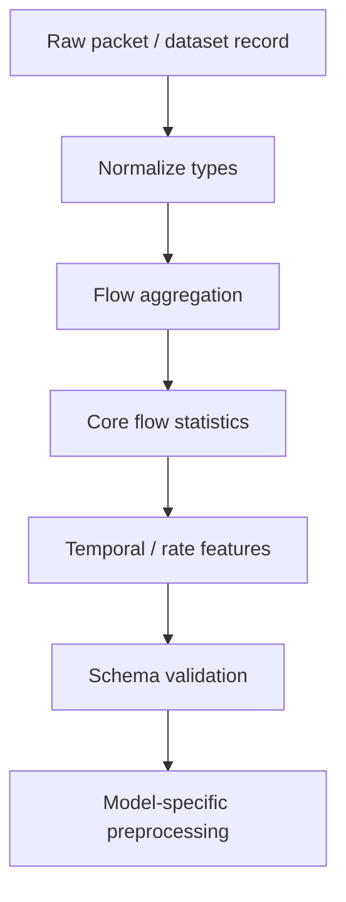
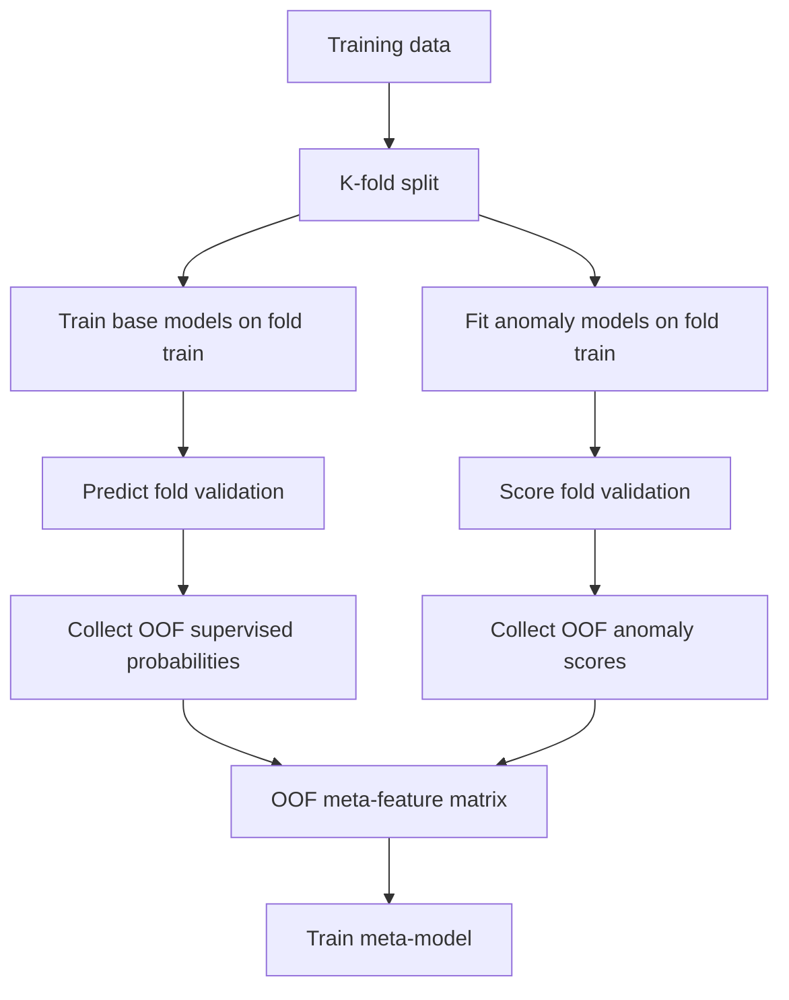
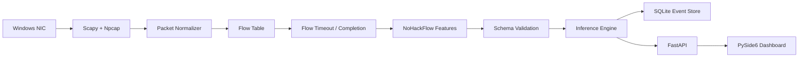
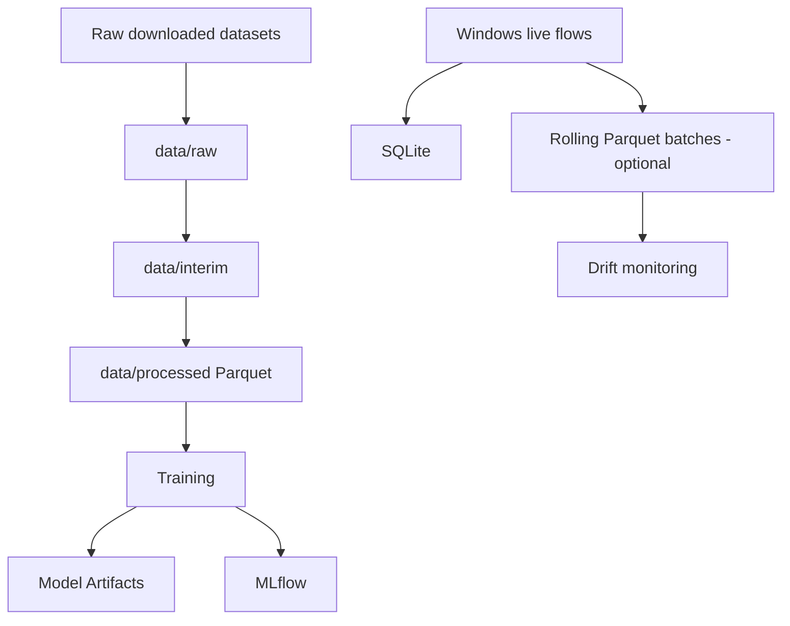
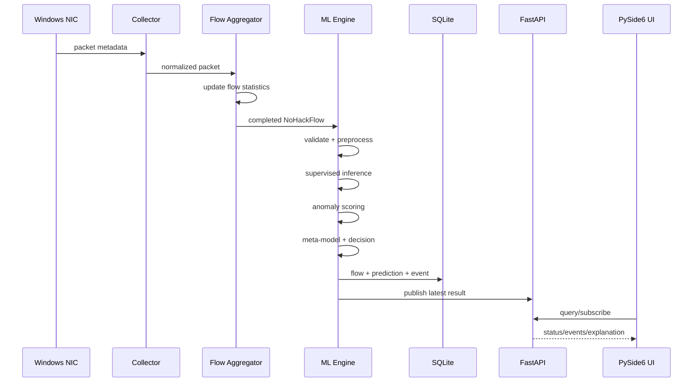
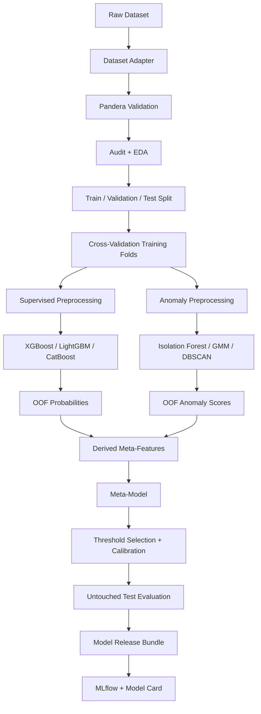

# No Hack

> **AI-Powered Real-Time Network Threat & Anomaly Detection System for Windows**

**No Hack** is an end-to-end defensive cybersecurity + data science + machine learning engineering project that analyzes network-flow behavior on a Windows machine and estimates whether observed traffic is **normal, a known threat, a novel/anomalous pattern, or uncertain**.

The project combines:

- supervised intrusion classification,
- unsupervised anomaly detection,
- stacked/meta-model decision fusion,
- calibrated risk scoring,
- explainable AI,
- live Windows network-flow collection,
- model/data drift monitoring,
- local API serving,
- a Windows desktop dashboard,
- experiment tracking, testing, and CI/CD.

The goal is not to claim that a network connection is mathematically “secure.” Instead, No Hack performs **risk assessment from observable network-flow features** and reports suspicious patterns with evidence and confidence.

---

## 1. Project Objective

The initial research architecture is based on a hybrid intrusion-detection pipeline trained on tabular network-connection features such as those found in **NSL-KDD**:

```text
Network Dataset
      |
      v
Preprocessing
      |
      +-----------------------------+
      |                             |
      v                             v
Supervised Branch              Unsupervised Branch
LightGBM                       Isolation Forest
CatBoost                       DBSCAN
XGBoost                        Gaussian Mixture Model
      |                             |
      v                             v
Class probabilities             Anomaly signals
      |                             |
      +-------------+---------------+
                    |
                    v
             Derived Meta-Features
                    |
                    v
                Meta-Model
                    |
                    v
     Normal / Known Threat / Novel Anomaly
```

No Hack extends this research architecture into a usable Windows ML product:

```text
Windows Network Traffic
          |
          v
 Packet / Connection Collector
          |
          v
     Flow Aggregator
          |
          v
  Feature Engineering
          |
          v
   Schema Validation
          |
          v
 Hybrid ML Detection Engine
          |
          +-----------------------------+
          |                             |
          v                             v
 Supervised Ensemble              Anomaly Ensemble
 XGBoost                          Isolation Forest
 LightGBM                         DBSCAN
 CatBoost                         Gaussian Mixture
          |                             |
          +-------------+---------------+
                        |
                        v
               Stacked Meta-Model
                        |
                        v
           Risk + Decision + Reason
                        |
          +-------------+-------------+
          |                           |
          v                           v
     Local Storage              FastAPI Service
                                      |
                                      v
                              PySide6 Windows UI
```

---

## 2. What No Hack Should Answer

For each completed network flow, No Hack should answer:

1. **What happened?**
   - protocol,
   - local/remote endpoint,
   - flow duration,
   - packets/bytes,
   - connection behavior.

2. **Does it resemble a known malicious pattern?**
   - supervised ensemble probability,
   - predicted attack family when supported.

3. **Is it statistically unusual compared with normal traffic?**
   - Isolation Forest score,
   - GMM likelihood,
   - DBSCAN noise/cluster signal.

4. **How much do the models agree?**
   - classifier agreement,
   - classifier/anomaly disagreement,
   - uncertainty.

5. **Why did the system flag it?**
   - SHAP/local feature contributions,
   - human-readable reason codes.

6. **Is the current live traffic different from the traffic used during training?**
   - data drift,
   - prediction drift,
   - anomaly-rate drift.

---

## 3. Product Output Vocabulary

Do **not** use only `SECURE / NOT SECURE` as the model output. That wording overstates what a network-flow ML model can prove.

The canonical No Hack states are:

```text
NORMAL
KNOWN_THREAT
NOVEL_ANOMALY
UNCERTAIN
```

### NORMAL

The supervised ensemble does not strongly indicate a known attack and anomaly models do not show unusual behavior.

### KNOWN_THREAT

The supervised system has sufficiently strong evidence that the flow resembles an attack pattern represented in training data.

The UI may additionally display an attack-family label if the attack-family classifier is sufficiently confident.

### NOVEL_ANOMALY

The traffic is strongly abnormal according to the anomaly branch but does not confidently match a learned attack family.

**Important:** `NOVEL_ANOMALY` must never automatically be described as a “zero-day attack.” An anomaly is evidence of unusual behavior, not proof of an unknown exploit.

### UNCERTAIN

Used when:

- the prediction is close to a configured threshold,
- base models strongly disagree,
- the live feature vector is outside the expected training distribution,
- required features are incomplete,
- the model or feature schema does not match the live input.

---

# 4. Scope

## In scope

- defensive network-flow monitoring on the user’s own/authorized Windows machine,
- tabular ML intrusion classification,
- supervised + unsupervised ensemble learning,
- anomaly/novelty detection,
- explainable AI,
- local real-time inference,
- local dashboard,
- experiment tracking,
- model monitoring,
- data drift monitoring,
- reproducible training and evaluation,
- Windows packaging.

## Not part of the initial build

To keep the project technically strong but buildable, the first production version intentionally avoids:

- Kubernetes,
- Kafka,
- distributed microservices,
- a separate database server,
- cloud dependency for inference,
- deep packet inspection of application payloads,
- automatic network blocking,
- an LLM making the security decision,
- autonomous response/remediation,
- full reinforcement learning.

These can be researched later only when the core ML system is stable.

---

# 5. Core Engineering Principle: Prevent Training–Serving Skew

This is one of the most important design rules in No Hack.

A model trained on a feature that cannot be reproduced from live Windows traffic must **not** be deployed as the live model.

NSL-KDD is useful for reproducing and validating the original research architecture, but its full 41-feature representation should not be assumed to be directly obtainable from modern live Windows traffic.

Therefore No Hack has two clearly separated stages:

```text
Stage A — Research/Reproduction
NSL-KDD -> original hybrid architecture -> benchmark results

Stage B — Deployable No Hack Model
modern flow dataset + NoHackFlow feature schema
                     |
                     v
same feature extraction logic used offline and live
                     |
                     v
               Windows inference
```

The **deployable model** is trained only on features that the runtime collector can reproduce.

---

# 6. Datasets

## 6.1 NSL-KDD — Architecture Reproduction Dataset

Use NSL-KDD first to reproduce the architecture shown in the original project diagram.

Purpose:

- establish baselines,
- validate preprocessing,
- implement supervised ensemble,
- implement anomaly ensemble,
- implement out-of-fold stacking,
- implement evaluation,
- reproduce the original research idea.

NSL-KDD should be treated as a **research benchmark**, not the final proof that the Windows runtime works on modern traffic.

## 6.2 CICIDS2017 — Primary Modern Flow Benchmark

CICIDS2017 provides labeled network flows, packet captures, and machine-learning CSV files. It should be used as the first modern benchmark after the NSL-KDD reproduction stage.

Purpose:

- train on flow-oriented features closer to runtime collection,
- test binary and multiclass intrusion detection,
- study realistic imbalance,
- build a feature compatibility layer.

## 6.3 CSE-CIC-IDS2018 — External / Larger Benchmark

CSE-CIC-IDS2018 contains multiple intrusion scenarios and more than 80 traffic features generated from captured network traffic.

Purpose:

- external validation,
- larger experiments,
- distribution-shift/generalization study,
- later benchmarking of the deployable No Hack feature subset.

## 6.4 Local Windows Benign Traffic

Later in development, collect **only traffic you own or are authorized to monitor** from the Windows machine.

Use local captures primarily for:

- validating the live feature extractor,
- latency testing,
- feature-range analysis,
- drift experiments,
- benign calibration.

Do not assign malicious labels to local traffic without evidence.

---

# 7. Canonical Live Feature Schema: `NoHackFlow`

No Hack should create its own versioned runtime schema instead of making the Windows agent depend directly on a specific public dataset schema.

A flow is identified primarily by a 5-tuple:

```text
source IP
source port
destination IP
destination port
transport protocol
```

The initial deployable feature set should contain features that can be consistently produced from packet/connection metadata.

## 7.1 Core flow features

```text
duration_ms
protocol
src_port
dst_port
forward_packet_count
backward_packet_count
forward_byte_count
backward_byte_count
total_packet_count
total_byte_count
forward_packets_per_second
backward_packets_per_second
bytes_per_second
packets_per_second
packet_length_min
packet_length_max
packet_length_mean
packet_length_std
forward_packet_length_mean
backward_packet_length_mean
flow_iat_mean
flow_iat_std
flow_iat_min
flow_iat_max
forward_iat_mean
backward_iat_mean
syn_count
ack_count
fin_count
rst_count
psh_count
forward_backward_packet_ratio
forward_backward_byte_ratio
```

Add advanced active/idle and window-based features only after the core extractor has tests proving identical offline/live behavior.

## 7.2 Context fields — stored but not necessarily model inputs

```text
flow_id
started_at
ended_at
local_ip
remote_ip
process_id
process_name
interface_name
model_version
feature_schema_version
```

Raw IP addresses and process names should initially be treated as **context**, not predictive features. Otherwise, the model can learn host identity or application names instead of traffic behavior.

## 7.3 Feature-version contract

Every inference request must carry:

```text
feature_schema_version
model_version
```

The runtime refuses inference if the model expects a different feature schema.

---

# 8. Feature Engineering Architecture



The same core feature code must be reused by:

- offline PCAP processing,
- dataset adapters where possible,
- live Windows flow generation.

Do not create one independent notebook implementation and another independent production implementation for the same feature. Put feature logic in reusable Python modules and import it in both places.

---

# 9. Data Science Pipeline

## 9.1 Data audit

For every dataset produce an automated report containing:

- number of rows,
- number of features,
- label distribution,
- duplicate count,
- missing values,
- invalid/infinite values,
- constant features,
- near-constant features,
- numerical ranges,
- categorical cardinalities,
- class imbalance ratio.

## 9.2 Exploratory Data Analysis

The EDA stage should include:

- target distribution,
- per-feature distributions,
- correlation analysis,
- feature/label relationships,
- attack-family frequencies,
- outlier analysis,
- class overlap,
- potential data leakage features,
- temporal distribution where timestamps exist.

The final repository should include reproducible reports rather than screenshots only.

## 9.3 Split before learning anything

The dataset must be split **before** fitting:

- encoders,
- scalers,
- oversampling,
- feature selectors,
- calibrators,
- models.

Recommended logical split:

```text
Training set
Validation set
Final untouched test set
```

If reliable timestamps are available, also run a **time-aware holdout experiment** because random stratification can overestimate performance when similar traffic from the same period appears in both train and test.

## 9.4 Data leakage rule

The final test set is used only after:

- preprocessing decisions are locked,
- hyperparameters are selected,
- thresholds are selected,
- feature selection is finished,
- calibration is finished.

---

# 10. Preprocessing

The project should maintain separate preprocessing requirements for supervised and anomaly models.

## 10.1 Supervised preprocessing

For mixed categorical/numerical datasets such as NSL-KDD:

```text
Categorical columns
    -> clean values
    -> encode using train-fitted encoder

Numerical columns
    -> replace invalid values
    -> impute if required
```

Tree boosting models usually do not require standardization in the same way distance/density models do.

Use a `ColumnTransformer`/pipeline rather than manually transforming train and test data separately.

## 10.2 Anomaly preprocessing

Distance-, density-, and distribution-based methods are sensitive to scale and dimensionality.

Anomaly branch:

```text
categorical encoding
      +
numerical scaling
      |
      v
optional dimensionality reduction
      |
      +--> Isolation Forest
      +--> DBSCAN
      +--> Gaussian Mixture Model
```

For DBSCAN/GMM experiments, dimensionality reduction may be evaluated if one-hot encoding produces a very high-dimensional space.

Any PCA/TruncatedSVD model must be fitted on the training fold only.

---

# 11. Class Imbalance Strategy

Intrusion datasets are often imbalanced. No Hack must compare approaches rather than automatically applying SMOTE to everything.

Experiments:

1. no resampling + class weights,
2. random oversampling,
3. SMOTE/SMOTENC where technically appropriate,
4. optional Borderline-SMOTE/SMOTEENN as an ablation.

**Critical rules:**

- resampling is performed on training data only,
- during cross-validation, resampling occurs *inside each training fold*,
- validation/test data are never synthetically resampled,
- categorical features should not be blindly interpolated as ordinary continuous numbers.

Use `imblearn.pipeline.Pipeline` for leakage-safe resampling experiments.

---

# 12. Supervised Branch

## 12.1 Baselines

Before advanced boosting, train simple baselines:

- Logistic Regression,
- Random Forest,
- optionally a single Decision Tree for interpretability.

The project is stronger when it can show that the advanced architecture improves on a reproducible baseline.

## 12.2 Main ensemble

The primary supervised branch is:

```text
LightGBM
CatBoost
XGBoost
```

Each model outputs probabilities rather than only a hard label.

For binary intrusion detection:

```text
p_lgbm_attack
p_catboost_attack
p_xgb_attack
```

For attack-family classification, preserve the per-class probabilities separately.

## 12.3 Probability calibration

Raw model probabilities should be evaluated for calibration.

Compare:

- uncalibrated probabilities,
- sigmoid calibration,
- isotonic calibration where the validation sample size is adequate.

Track:

- calibration curve,
- Brier score,
- expected calibration error if implemented.

Only use a calibrated probability as a user-facing “confidence” when calibration quality has been evaluated.

---

# 13. Unsupervised / Novelty Detection Branch

The anomaly branch contains the models from the original architecture:

## Isolation Forest

Purpose:

- produce an anomaly score for each flow,
- identify observations that are easier to isolate from normal patterns.

Preferred production experiment:

- fit primarily on benign/normal training traffic when labels are available,
- score normal + attack validation/test traffic.

## Gaussian Mixture Model

Purpose:

- estimate the likelihood of a feature vector under the learned traffic distribution,
- low log-likelihood can be converted into an anomaly signal.

## DBSCAN

Purpose:

- density-based cluster/noise experiment,
- produce a cluster/noise-derived signal.

DBSCAN is retained because it is part of the original architecture, but it should be considered an **experimental branch** until latency, dimensionality, and generalization results justify runtime use.

## Normalized anomaly representation

Convert heterogeneous anomaly outputs into normalized meta-features such as:

```text
iforest_score
gmm_log_likelihood
dbscan_noise_flag
iforest_vote
gmm_vote
dbscan_vote
unsupervised_vote_count
combined_anomaly_score
```

Normalization parameters and thresholds must be learned from training/validation data and stored with the model artifacts.

---

# 14. Stacked Ensemble / Meta-Model

This is the core fusion layer.

## 14.1 Do not train the meta-model on in-sample predictions

If a base model predicts the same samples that were used to train it and those predictions are used to train the meta-model, the stack can become unrealistically optimistic.

Use **out-of-fold (OOF) predictions**.



After meta-model development is complete:

- retrain base supervised models on the full training data,
- retrain anomaly components on the appropriate full training subset,
- retain the trained meta-model and its feature contract,
- evaluate once on the untouched test set.

## 14.2 Meta-features

The meta-feature vector should include:

### Base supervised outputs

```text
xgb_attack_probability
lgbm_attack_probability
catboost_attack_probability
```

### Unsupervised outputs

```text
isolation_forest_score
gmm_log_likelihood
dbscan_noise_flag
```

### Derived features

```text
supervised_mean_probability
supervised_probability_std
supervised_vote_count
unsupervised_vote_count
supervised_agreement
supervised_disagreement
supervised_vs_unsupervised_gap
```

### Optional raw features

A small number of stable, high-value raw flow features may be passed to the meta-model **only after an ablation study proves that they add value**.

The original concept proposed approximately five raw features selected using the XGBoost importance ranking. For the final system, compare:

- XGBoost importance,
- permutation importance,
- SHAP global importance.

Do not automatically choose a feature only because one importance method ranks it highly.

## 14.3 Meta-model

Default:

```text
Logistic Regression
```

Reason:

- easier to interpret,
- lower overfitting risk,
- useful as a clean fusion layer.

Alternative experiment:

```text
shallow XGBoost
```

Use the more complex meta-model only if held-out experiments show meaningful improvement.

---

# 15. Final Decision Logic

The model should not use a single hard-coded `0.5` threshold without validation.

Thresholds are selected using validation data and stored in configuration/model metadata.

Conceptual decision logic:

```text
IF known-threat probability >= known-threat threshold:
    KNOWN_THREAT

ELSE IF anomaly score >= anomaly threshold
        AND known-threat confidence is low:
    NOVEL_ANOMALY

ELSE IF prediction is close to threshold
        OR models disagree strongly
        OR feature drift is severe:
    UNCERTAIN

ELSE:
    NORMAL
```

Threshold selection should be evaluated using a security-relevant objective such as:

- high recall subject to an acceptable false-positive rate,
- F-beta where recall is deliberately weighted,
- an explicit false-negative/false-positive cost function.

The chosen objective must be documented rather than selected after seeing the final test results.

---

# 16. Explainable AI

No Hack must explain why a flow received a risk score.

## 16.1 Global explainability

Generate:

- SHAP global feature importance,
- permutation importance,
- feature dependence plots where useful,
- per-class importance for multiclass models.

## 16.2 Local explanations

For a flagged flow, return a small number of dominant signals, for example:

```text
Decision: KNOWN_THREAT
Risk probability: 0.93

Top contributing signals:
- unusually high packet rate
- repeated short-lived connections
- high reset-flag rate
- abnormal forward/backward traffic ratio
```

Descriptions should be generated from structured feature/rule mappings.

An LLM is **not required** for the security decision and should not be introduced merely to label the project “GenAI.”

---

# 17. Evaluation Plan

Accuracy alone is not sufficient.

## Binary detection metrics

Track:

```text
precision
recall / detection rate
F1
F2 (optional)
PR-AUC
ROC-AUC
balanced accuracy
Matthews correlation coefficient
false-positive rate
false-negative rate
confusion matrix
```

## Multiclass attack-family metrics

Track:

```text
macro precision
macro recall
macro F1
weighted F1
per-class precision
per-class recall
per-class F1
confusion matrix
one-vs-rest ROC-AUC where appropriate
```

## Probability metrics

Track:

```text
Brier score
calibration curve
log loss where applicable
```

## Runtime metrics

Track:

```text
p50 inference latency
p95 inference latency
flows processed per second
feature extraction latency
memory usage
CPU usage
model artifact size
```

---

# 18. Required Ablation Studies

A resume-quality project should prove which pieces actually help.

Run at least these comparisons:

```text
1. Logistic Regression baseline
2. Random Forest baseline
3. XGBoost only
4. LightGBM only
5. CatBoost only
6. supervised probability average
7. supervised stack only
8. anomaly branch only
9. supervised + anomaly meta-model
10. meta-model without derived disagreement features
11. meta-model without raw top features
12. class weights vs resampling
13. calibrated vs uncalibrated probabilities
```

Report mean cross-validation performance plus the final untouched test result.

---

# 19. Hyperparameter Optimization

Use **Optuna** rather than an enormous manual grid.

Tune models independently first.

Examples of search targets:

### XGBoost / LightGBM

```text
learning rate
number of estimators / boosting rounds
max depth / number of leaves
subsample
column sampling
regularization
minimum child constraints
```

### CatBoost

```text
depth
learning rate
iterations
L2 regularization
random strength
```

### Isolation Forest

```text
n_estimators
max_samples
max_features
contamination strategy
```

### GMM

```text
n_components
covariance_type
reg_covar
```

### DBSCAN

```text
eps
min_samples
distance metric
```

Optuna optimizes on cross-validation/validation metrics only. Never tune against the final test set.

---

# 20. Windows Live Collection Architecture

## 20.1 Libraries

Use:

- **Scapy** for packet capture/parsing,
- **Npcap** as the required Windows packet-capture driver for Scapy,
- **psutil** for system/socket/process context.

The collector must only monitor network interfaces and traffic the user is authorized to observe.

## 20.2 Runtime flow



## 20.3 Flow table

Maintain an in-memory flow table keyed by normalized 5-tuple.

The aggregator records timestamps, directions, byte/packet counts, inter-arrival statistics and TCP flag statistics.

Flows are finalized when:

- FIN/RST indicates closure where applicable,
- or an idle timeout expires,
- or a maximum flow lifetime is reached.

Timeouts are configuration values, not magic constants hard-coded throughout the codebase.

## 20.4 Process attribution

`psutil` can provide system/process connection information.

Process attribution is **best effort** and should be treated as enrichment rather than a guaranteed property of every captured packet.

The initial ML model should not train on `process_name` unless the training dataset also contains compatible process-level information.

---

# 21. Local Inference Engine

The inference engine is a Python package shared by:

- CLI experiments,
- API,
- Windows agent,
- integration tests.

Canonical pipeline:

```text
NoHackFlow
   |
   v
schema validation
   |
   v
feature ordering / preprocessing
   |
   +--> supervised models
   |
   +--> anomaly models
   |
   v
meta-feature builder
   |
   v
meta-model
   |
   v
decision policy
   |
   +--> risk score
   +--> state
   +--> attack family
   +--> uncertainty
   +--> explanation
```

The runtime must never manually rebuild feature ordering from memory. Feature names/order are loaded from the versioned model manifest.

---

# 22. Model Artifact Contract

Each trained release should create a directory like:

```text
artifacts/models/nohack-<version>/
|
|-- manifest.json
|-- feature_schema.json
|-- thresholds.json
|-- supervised/
|   |-- xgboost.*
|   |-- lightgbm.*
|   `-- catboost.*
|-- anomaly/
|   |-- isolation_forest.*
|   |-- gmm.*
|   `-- dbscan_config.json
|-- meta/
|   `-- meta_model.*
|-- preprocessing/
|   |-- supervised_preprocessor.*
|   `-- anomaly_preprocessor.*
`-- metrics.json
```

`manifest.json` should contain:

```json
{
  "project": "No Hack",
  "model_version": "...",
  "feature_schema_version": "...",
  "training_dataset": "...",
  "training_commit": "...",
  "created_at": "...",
  "primary_metric": "...",
  "threshold_version": "..."
}
```

Do not load model artifacts downloaded from untrusted sources. Python pickle/joblib-style serialization can execute code during loading.

---

# 23. Local API

Use **FastAPI + Pydantic**.

The API remains local by default:

```text
127.0.0.1
```

Initial endpoints:

```text
GET  /health
GET  /status
GET  /model
GET  /events
GET  /events/{event_id}
GET  /metrics
POST /predict          # development/testing; accepts a validated feature object
WS   /ws/events        # optional real-time dashboard stream
```

## Example prediction response

```json
{
  "state": "NOVEL_ANOMALY",
  "risk_probability": 0.62,
  "anomaly_score": 0.91,
  "known_attack_confidence": 0.31,
  "attack_family": null,
  "uncertainty": 0.18,
  "top_reasons": [
    "high packet rate",
    "unusual flow duration",
    "high anomaly-model agreement"
  ],
  "model_version": "...",
  "feature_schema_version": "..."
}
```

---

# 24. Windows Desktop UI

Use **PySide6 (Qt for Python)** so the entire first implementation can remain primarily Python.

## Main dashboard

Display:

```text
No Hack

Monitoring: ON
Model: <version>
Feature schema: <version>

Current assessment:
NORMAL / KNOWN THREAT / NOVEL ANOMALY / UNCERTAIN

Risk level
Live flows
Threat events
Novel anomalies
Model latency
Drift status
```

## Event table

Columns:

```text
Time
Process
Protocol
Remote endpoint
State
Risk
Anomaly score
Attack family
```

## Event details panel

Show:

- flow metadata,
- supervised probabilities,
- anomaly scores,
- model agreement,
- top explanation features,
- model version,
- feature schema version.

## Model health panel

Show:

```text
Model loaded
Average latency
p95 latency
Prediction count
Recent anomaly rate
Feature drift status
Prediction drift status
```

Avoid a UI statement such as:

```text
YOUR CONNECTION IS 100% SECURE
```

Prefer:

```text
Current observed traffic: no suspicious flow detected
```

---

# 25. Storage Architecture

No Hack is local-first and does not require PostgreSQL/Redis/Kafka for the initial system.



## 25.1 Offline data

Use **Parquet through PyArrow** for processed tabular datasets.

Reasons:

- columnar storage,
- typed schema,
- efficient reading of subsets,
- better fit than repeatedly storing large processed CSV files.

Keep original public downloads immutable under `data/raw/` and do not commit large datasets to Git.

## 25.2 Runtime event database

Use **SQLite** initially.

Suggested tables:

```text
flows
predictions
events
model_status
drift_runs
```

SQLite is sufficient for a single-machine portfolio application and keeps deployment simple.

## 25.3 Experiment storage

Use **MLflow** locally for:

- parameters,
- metrics,
- plots,
- artifacts,
- model metadata,
- experiment comparison.

A local tracking database/artifact directory is enough for this project.

---

# 26. Data Validation

Use **Pandera** for dataframe-level schema validation during training/data processing.

Validate:

- required columns,
- dtypes,
- allowed categorical values where appropriate,
- non-negative counters,
- finite numerical values,
- duplicate identifiers where prohibited,
- label validity.

Use **Pydantic** for API/runtime object validation.

This intentionally separates:

```text
Pandera -> dataframe contracts
Pydantic -> runtime/API object contracts
```

---

# 27. Drift & Production Monitoring

Use **Evidently** or small custom statistical checks once live data exists.

Monitor:

## Data drift

Compare the recent live feature window with a reference training/validation window.

Candidate signals:

- Kolmogorov-Smirnov test for selected continuous features,
- Jensen-Shannon distance,
- Population Stability Index,
- categorical distribution changes.

Do not blindly alarm on every statistically significant change; use minimum effect sizes and practical thresholds.

## Prediction drift

Track changes in:

```text
NORMAL rate
KNOWN_THREAT rate
NOVEL_ANOMALY rate
UNCERTAIN rate
mean risk probability
```

## Service monitoring

Track:

```text
capture health
feature extraction errors
schema validation errors
inference errors
p50 latency
p95 latency
memory
CPU
```

## Model performance monitoring

True real-time accuracy cannot be calculated without reliable ground-truth labels.

When labels later become available, compute performance separately rather than pretending anomaly rate is accuracy.

---

# 28. Recommended Technology Stack

The stack is deliberately compact.

| Area | Technology | Purpose |
|---|---|---|
| Language | Python 3.11 | stable unified DS/ML/backend/desktop language |
| Tabular data | pandas, NumPy | data processing |
| Efficient storage | PyArrow / Parquet | processed datasets |
| Scientific computing | SciPy | statistics/math |
| Data validation | Pandera | dataframe schema checks |
| Core ML | scikit-learn | pipelines, metrics, baselines, anomaly models |
| Gradient boosting | XGBoost | supervised classifier |
| Gradient boosting | LightGBM | supervised classifier |
| Gradient boosting | CatBoost | supervised classifier |
| Imbalance | imbalanced-learn | SMOTE/SMOTENC and leakage-safe pipelines |
| Hyperparameter tuning | Optuna | experiment optimization |
| Explainability | SHAP | local/global tree explanations |
| Experiment tracking | MLflow | runs, metrics, artifacts |
| Drift monitoring | Evidently | drift/evaluation reports |
| Packet capture | Scapy | packet parsing/capture |
| Windows packet driver | Npcap | Scapy Windows capture dependency |
| System context | psutil | sockets/process enrichment |
| API | FastAPI | local inference/status service |
| Runtime validation | Pydantic | API/config schemas |
| Server | Uvicorn | local ASGI server |
| Desktop UI | PySide6 | Windows dashboard |
| Runtime database | SQLite | local flows/events |
| Testing | pytest, pytest-cov | unit/integration tests |
| Lint/format | Ruff | code quality |
| Static typing | mypy | type checks |
| CI | GitHub Actions | automated tests/checks |
| Packaging | PyInstaller | Windows executable packaging |
| Containers | Docker | reproducible training/API experiments only |

### Why no Redis/Kafka/PostgreSQL/Kubernetes now?

The first target is a **single Windows machine**. These technologies would add infrastructure work without solving a current bottleneck. Add them only if future requirements genuinely become distributed.

### Docker boundary

Docker is useful for reproducible training/API development, but the Windows packet collector should run natively because it requires direct access to Windows capture facilities.

---

# 29. Repository Structure

```text
no-hack/
|
|-- README.md
|-- LICENSE
|-- pyproject.toml
|-- .gitignore
|-- .env.example
|-- Makefile                         # optional helper commands
|
|-- configs/
|   |-- train_nsl_kdd.yaml
|   |-- train_cicids2017.yaml
|   |-- train_cicids2018.yaml
|   |-- runtime.yaml
|   `-- thresholds.yaml
|
|-- data/
|   |-- README.md
|   |-- raw/                         # gitignored
|   |-- interim/                     # gitignored
|   |-- processed/                   # gitignored
|   `-- samples/                     # tiny safe fixtures only
|
|-- notebooks/
|   |-- 01_nsl_kdd_eda.ipynb
|   |-- 02_baselines.ipynb
|   |-- 03_supervised_models.ipynb
|   |-- 04_anomaly_models.ipynb
|   |-- 05_stacking_analysis.ipynb
|   `-- 06_explainability.ipynb
|
|-- src/
|   `-- nohack/
|       |-- __init__.py
|       |
|       |-- data/
|       |   |-- loaders.py
|       |   |-- schemas.py
|       |   |-- audit.py
|       |   `-- split.py
|       |
|       |-- datasets/
|       |   |-- base.py
|       |   |-- nsl_kdd.py
|       |   |-- cicids2017.py
|       |   `-- cicids2018.py
|       |
|       |-- features/
|       |   |-- flow_schema.py
|       |   |-- flow_state.py
|       |   |-- aggregator.py
|       |   |-- temporal.py
|       |   `-- selectors.py
|       |
|       |-- preprocessing/
|       |   |-- supervised.py
|       |   |-- anomaly.py
|       |   `-- imbalance.py
|       |
|       |-- models/
|       |   |-- baselines.py
|       |   |-- supervised.py
|       |   |-- anomaly.py
|       |   |-- calibration.py
|       |   |-- stacking.py
|       |   `-- decision.py
|       |
|       |-- training/
|       |   |-- train.py
|       |   |-- cross_validation.py
|       |   |-- oof.py
|       |   |-- tuning.py
|       |   |-- evaluate.py
|       |   `-- ablation.py
|       |
|       |-- explainability/
|       |   |-- shap_explainer.py
|       |   |-- permutation.py
|       |   `-- reasons.py
|       |
|       |-- inference/
|       |   |-- engine.py
|       |   |-- artifact_loader.py
|       |   `-- result.py
|       |
|       |-- collector/
|       |   |-- capture.py
|       |   |-- packet_parser.py
|       |   |-- process_mapper.py
|       |   `-- service.py
|       |
|       |-- monitoring/
|       |   |-- drift.py
|       |   |-- service_metrics.py
|       |   `-- model_health.py
|       |
|       |-- storage/
|       |   |-- database.py
|       |   |-- repositories.py
|       |   `-- retention.py
|       |
|       |-- api/
|       |   |-- main.py
|       |   |-- dependencies.py
|       |   |-- schemas.py
|       |   `-- routes/
|       |
|       |-- ui/
|       |   |-- app.py
|       |   |-- main_window.py
|       |   |-- event_model.py
|       |   `-- widgets/
|       |
|       |-- config/
|       |   |-- settings.py
|       |   `-- logging.py
|       |
|       `-- cli.py
|
|-- tests/
|   |-- unit/
|   |-- integration/
|   |-- feature_parity/
|   `-- fixtures/
|
|-- artifacts/                       # generated; mostly gitignored
|   |-- models/
|   |-- reports/
|   `-- figures/
|
|-- mlruns/                          # local MLflow; gitignored
|
|-- scripts/
|   |-- download_data.py
|   |-- prepare_data.py
|   |-- train_all.py
|   |-- evaluate_release.py
|   `-- package_windows.ps1
|
|-- docs/
|   |-- architecture.md
|   |-- datasets.md
|   |-- feature_schema.md
|   |-- model_card.md
|   |-- threat_model.md
|   `-- demo.md
|
|-- .github/
|   `-- workflows/
|       |-- ci.yml
|       `-- windows-build.yml
|
|-- Dockerfile
`-- docker-compose.yml                # optional local experiment services
```

---

# 30. Module Responsibilities

## `datasets/`

Dataset-specific mapping only.

It converts external dataset columns/labels into internal structures. No model logic belongs here.

## `features/`

The most important shared code.

Contains the canonical flow state, feature calculations and schema/version definition.

## `preprocessing/`

Creates fitted preprocessing pipelines. No UI/runtime logic.

## `models/`

Contains model factories/wrappers only.

## `training/`

Owns CV, OOF prediction, tuning, evaluation and model-release creation.

## `inference/`

Loads a released artifact bundle and exposes one stable prediction interface.

## `collector/`

Windows network capture and process enrichment.

It does not know model internals; it only emits `NoHackFlow` objects.

## `api/`

Local API over the inference/collector/storage services.

## `ui/`

Presentation only. No ML code should be duplicated in the GUI.

## `monitoring/`

Data drift, prediction drift and service/model-health metrics.

---

# 31. Runtime Data Flow



---

# 32. Training Data Flow



---

# 33. API / UI Separation

Keep the UI replaceable.

```text
PySide6 UI
    |
    v
FastAPI local interface
    |
    +--> collector status
    +--> inference engine
    +--> event repository
    +--> monitoring
```

The model should still work through CLI/tests even if the UI is removed.

---

# 34. Experiment Tracking

Every training run should record to MLflow:

```text
dataset name/version
feature schema version
Git commit
random seed
split strategy
preprocessing configuration
resampling strategy
model type
hyperparameters
CV metrics
validation metrics
calibration metrics
thresholds
feature importance artifacts
confusion matrices
PR/ROC curves
latency benchmark
final model artifacts
```

Use fixed random seeds for reproducibility while recognizing that some native parallel algorithms may still have small platform-dependent differences.

---

# 35. Model Card

Every released model should have `docs/model_card.md` containing:

- intended use,
- datasets,
- target definition,
- feature schema,
- algorithms,
- train/validation/test strategy,
- evaluation results,
- class-wise limitations,
- calibration results,
- chosen thresholds,
- known failure cases,
- runtime requirements,
- privacy considerations,
- model/version identifiers.

---

# 36. Testing Strategy

## Unit tests

Test:

- flow statistics,
- packet direction logic,
- timestamp calculations,
- encoders,
- schemas,
- decision thresholds,
- reason generation,
- database repositories.

## Feature parity tests

This is essential.

Take a small deterministic PCAP/sample trace and assert that:

```text
offline feature extractor output == live-path feature extractor output
```

within expected numerical tolerances.

## Model contract tests

Test:

- correct feature version loads,
- incorrect feature version fails,
- missing features fail,
- reordered inputs do not silently change predictions,
- NaN/inf inputs are rejected or handled according to contract.

## Integration tests

Test:

```text
sample flow -> inference -> DB -> API response
```

## UI smoke tests

At minimum verify startup and API connectivity for packaged Windows builds.

---

# 37. CI/CD

Use GitHub Actions.

On pull request/push:

```text
install Python
install dependencies
ruff check
mypy
pytest
coverage
small deterministic inference test
```

Use a separate Windows workflow for:

- Windows-specific collector imports,
- PySide6 startup/build validation,
- PyInstaller packaging.

Do **not** attempt to run privileged packet-capture integration tests on a generic CI runner unless the runner is explicitly configured for them.

---

# 38. Privacy & Security Design

No Hack itself is a security product, so its own data handling must be conservative.

Default policy:

- analyze flow metadata,
- do not persist packet payloads,
- do not send traffic to a cloud service,
- local inference by default,
- restrict the API to localhost,
- configurable event retention,
- redact/hash endpoint information in exported reports when needed,
- never load untrusted serialized model files,
- log application errors without dumping sensitive packet contents.

---

# 39. Development Setup

## Requirements

- Windows 10/11 for live-agent development,
- Python 3.11 64-bit,
- Git,
- Npcap for live Scapy capture,
- optional Docker Desktop for reproducible API/training containers.

## Create environment

PowerShell:

```powershell
python -m venv .venv
.\.venv\Scripts\Activate.ps1
python -m pip install --upgrade pip
pip install -e ".[dev]"
```

## Run tests

```powershell
pytest
```

## Run training

Example intended CLI shape:

```powershell
python -m nohack.training.train --config configs/train_nsl_kdd.yaml
```

## Run local API

```powershell
uvicorn nohack.api.main:app --reload --host 127.0.0.1 --port 8000
```

## Run desktop UI

```powershell
python -m nohack.ui.app
```

The exact commands become binding only after the corresponding modules are implemented; keep this README updated when CLI interfaces change.

---

# 40. Configuration

Keep environment-dependent values outside source code.

Example `runtime.yaml`:

```yaml
collector:
  interface: auto
  flow_idle_timeout_seconds: 30
  max_flow_lifetime_seconds: 300

inference:
  model_path: artifacts/models/current
  require_schema_match: true

api:
  host: 127.0.0.1
  port: 8000

storage:
  sqlite_path: runtime/nohack.db
  retention_days: 14

monitoring:
  drift_enabled: true
  drift_window_size: 5000
```

These numbers are starting configuration examples, not research conclusions. Tune them during implementation and document the reason for final defaults.

---

# 41. Logging

Use structured application logs with levels:

```text
DEBUG
INFO
WARNING
ERROR
CRITICAL
```

Important events:

- collector start/stop,
- interface selected,
- model loaded,
- schema mismatch,
- inference failure,
- database failure,
- drift run,
- model-health warning.

Never log raw payloads by default.

---

# 42. Build Roadmap — Exact Recommended Order

The project should be built in this sequence. Do not begin the Windows GUI before the core model/data contracts are stable.

## Phase 0 — Repository bootstrap

Create:

- `pyproject.toml`,
- package structure,
- configuration loader,
- logging,
- pytest,
- Ruff,
- mypy,
- GitHub Actions,
- `.gitignore`,
- dataset documentation.

**Done when:** a clean clone installs and tests successfully.

---

## Phase 1 — Reproduce NSL-KDD baseline

Implement:

- dataset loader,
- schema validation,
- EDA,
- train/validation/test split,
- preprocessing pipeline,
- Logistic Regression baseline,
- Random Forest baseline,
- XGBoost baseline,
- metrics/report generation.

**Done when:** one command produces a reproducible evaluation report.

---

## Phase 2 — Supervised ensemble

Add:

- LightGBM,
- CatBoost,
- XGBoost,
- class imbalance experiments,
- Optuna tuning,
- calibrated probabilities,
- OOF predictions.

**Done when:** all three models produce versioned OOF/test probabilities and MLflow runs.

---

## Phase 3 — Anomaly branch

Add:

- Isolation Forest,
- GMM,
- DBSCAN,
- anomaly preprocessing,
- score normalization,
- validation-derived anomaly thresholds,
- anomaly evaluation.

**Done when:** anomaly scores are reproducible and can be consumed as meta-features.

---

## Phase 4 — Meta-model

Add:

- derived agreement/disagreement features,
- OOF meta-training matrix,
- Logistic Regression meta-model,
- shallow-XGBoost comparison,
- threshold selection,
- final state logic,
- full ablation study.

**Done when:** the final NSL-KDD hybrid model is evaluated once on the untouched test set.

---

## Phase 5 — Explainability

Add:

- SHAP for tree models,
- permutation importance,
- feature-level reason mapping,
- local explanation output.

**Done when:** a prediction can return a small human-readable set of reasons.

---

## Phase 6 — Modern flow model

Implement:

- CICIDS2017 adapter,
- CSE-CIC-IDS2018 adapter,
- `NoHackFlow` schema,
- shared flow feature implementation,
- compatibility analysis between public datasets and live features,
- retraining on the deployable feature subset,
- external/generalization testing.

**Done when:** the deployable model uses only runtime-reproducible features.

---

## Phase 7 — Inference package

Implement:

- artifact manifest,
- model loader,
- strict feature/schema checks,
- prediction result model,
- explanations,
- latency benchmark.

**Done when:** a `NoHackFlow` object produces a fully structured prediction without notebooks.

---

## Phase 8 — Windows collector

Implement:

- Scapy/Npcap capture,
- packet parser,
- flow table,
- flow expiration,
- `NoHackFlow` generation,
- psutil enrichment,
- feature parity tests.

**Done when:** authorized live Windows traffic creates validated flow objects matching the training feature contract.

---

## Phase 9 — Storage + FastAPI

Implement:

- SQLite schema,
- flow/event repositories,
- inference endpoint,
- health/model/status endpoints,
- event endpoint,
- optional WebSocket stream.

**Done when:** live predictions can be queried from a localhost API.

---

## Phase 10 — Windows UI

Implement:

- dashboard,
- live event table,
- event details,
- explanations,
- model health,
- drift status,
- start/stop monitoring controls.

**Done when:** a user can run No Hack and understand what the detector is observing without opening a terminal.

---

## Phase 11 — Drift/MLOps

Implement:

- reference feature window,
- current window,
- drift reports,
- prediction drift,
- model/service health,
- MLflow release tracking.

**Done when:** the UI/API can indicate when current traffic is substantially different from model-development data.

---

## Phase 12 — Windows packaging + portfolio release

Implement:

- PyInstaller build,
- release artifact,
- Windows build workflow,
- architecture diagrams,
- screenshots/demo video,
- final model card,
- benchmark report,
- limitations section.

**Done when:** another person can understand the architecture, reproduce the offline results, and run the Windows demo using documented steps.

---

# 43. Resume / Interview Evidence the Project Should Produce

No Hack should create visible evidence of the following skills rather than simply listing technologies.

## Data Scientist evidence

- EDA report,
- data-quality analysis,
- class-imbalance analysis,
- statistical evaluation,
- feature engineering,
- feature selection,
- model comparison,
- cross-validation,
- error analysis,
- calibration,
- threshold optimization,
- ablation studies.

## Machine Learning Engineer evidence

- reusable preprocessing pipelines,
- model artifacts,
- training/inference parity,
- OOF stacking,
- schema contracts,
- local model serving,
- latency testing,
- model versioning,
- tests.

## AI Engineer evidence

- multi-model decision fusion,
- anomaly/novelty detection,
- explainable AI,
- confidence/uncertainty handling,
- production monitoring,
- user-facing AI product integration.

## MLOps evidence

- MLflow tracking,
- reproducible configurations,
- drift monitoring,
- CI workflows,
- model release manifests,
- automated tests.

## Software/Product evidence

- FastAPI backend,
- SQLite persistence,
- PySide6 desktop client,
- modular architecture,
- Windows packaging,
- documentation.

---

# 44. Example Resume Description — Use Only After It Is Implemented

> **No Hack — AI-Powered Windows Network Intrusion & Anomaly Detection System**  
> Built an end-to-end network threat detection pipeline combining XGBoost, LightGBM and CatBoost with Isolation Forest, Gaussian Mixture and density-based anomaly signals; implemented leakage-safe out-of-fold stacking, probability calibration, explainability, model/data drift monitoring, FastAPI inference, and a Windows desktop client for live flow analysis.

Do not claim components on a resume until they exist in the repository and can be demonstrated.

---

# 45. Research Questions

No Hack can support genuine data-science investigation rather than only implementation.

Potential questions:

1. Does a stacked supervised ensemble outperform the strongest individual booster?
2. Does adding unsupervised anomaly information improve detection of attack samples poorly recognized by supervised models?
3. Which anomaly score contributes most to the meta-model?
4. Does supervised-model disagreement predict classification errors?
5. Does probability calibration reduce misleading confidence?
6. Which imbalance treatment gives the best recall/FPR tradeoff?
7. How much performance is lost when restricting training to features reproducible by the Windows runtime?
8. How well does a model trained on one dataset generalize to another traffic distribution?
9. Which features drift most between public datasets and real benign Windows traffic?
10. Can uncertainty gating reduce false high-confidence predictions?

These questions can become the basis for a project report or future research paper.

---

# 46. Common Mistakes to Avoid

Do not:

- perform SMOTE before train/test splitting,
- fit encoders/scalers on the full dataset,
- tune hyperparameters on the final test set,
- train the meta-model using base-model in-sample predictions,
- report only accuracy,
- call every anomaly a cyberattack,
- call every novel anomaly a zero-day,
- expose raw model probability as calibrated confidence without testing calibration,
- train on features that cannot be recreated at inference time,
- use process names/IP addresses as model inputs simply because they are available live,
- duplicate feature logic across notebooks and runtime code,
- commit large datasets/model artifacts unnecessarily,
- persist packet payloads by default,
- add an LLM just to claim GenAI,
- add microservices before a single-machine system requires them.

---

# 47. Definition of a Strong Final Demo

A convincing final No Hack demo should show this complete story:

```text
1. Start No Hack on Windows.
2. Agent begins monitoring authorized local network traffic.
3. Packets are aggregated into flows.
4. Runtime extracts the same deployable features used during training.
5. Supervised models produce known-threat probabilities.
6. Anomaly models produce novelty signals.
7. Meta-model fuses the evidence.
8. Decision policy returns NORMAL / KNOWN_THREAT / NOVEL_ANOMALY / UNCERTAIN.
9. SHAP/reason logic explains important features.
10. Prediction and flow metadata are stored locally.
11. Dashboard updates in real time.
12. Model-health panel displays latency and drift information.
```

The demo should include controlled, labeled/replayed benchmark traffic for evaluation rather than making unsupported claims about arbitrary real-world traffic.

---

# 48. Future Advanced Enhancements

Only consider these after the complete local system above works reliably.

## Better anomaly modelling

- HDBSCAN experiments,
- Local Outlier Factor in novelty-compatible evaluation,
- one-class SVM,
- autoencoder-based flow embeddings,
- deep tabular anomaly detection.

## Sequential / temporal modelling

- sliding-window host behavior,
- temporal sequence models,
- per-process behavior profiles,
- graph representations of host-to-destination relationships.

## Stronger generalization

- domain adaptation,
- cross-dataset evaluation,
- conformal prediction / prediction sets,
- uncertainty-aware abstention.

## Threat intelligence enrichment

Potential future metadata enrichment can be isolated from the core ML model and added only when legally/operationally appropriate.

## Local natural-language assistant

A future optional assistant could summarize structured No Hack evidence for the user.

It must never replace the detector or invent evidence. Its input should be structured predictions/explanations already produced by the ML system.

## Distributed deployment

Only if No Hack eventually monitors many endpoints:

- central event ingestion,
- message queues,
- PostgreSQL/analytics store,
- endpoint/model fleet management,
- centralized dashboards.

This is a future architecture, not required for the portfolio version.

---

# 49. Technical References Used for Stack Selection

Official/project documentation consulted when defining this architecture:

- scikit-learn — anomaly detection, clustering, Gaussian mixtures, probability calibration
- XGBoost — Python model interface
- LightGBM — Python model interface
- CatBoost — Python model interface
- imbalanced-learn — SMOTE/SMOTENC and imbalance pipelines
- SHAP — TreeExplainer for tree ensembles
- Optuna — hyperparameter studies and TPE-based optimization
- MLflow — experiment tracking and model artifacts
- Pandera — dataframe validation
- Apache Arrow / PyArrow — Parquet storage
- FastAPI — Python API framework and Pydantic request/response models
- Qt for Python / PySide6 — Windows desktop UI
- Scapy — Windows packet capture using Npcap
- psutil — socket/process/system information
- Evidently — data/prediction drift evaluation
- pytest — Python tests
- GitHub Actions — Python CI
- Docker — reproducible Python service/container development
- Canadian Institute for Cybersecurity — CICIDS2017 and CSE-CIC-IDS2018 dataset documentation

---

# 50. Project Status

```text
Architecture: defined
Repository: fresh build
Offline baseline: pending
Hybrid ensemble: pending
Deployable NoHackFlow schema: pending
Windows collector: pending
API: pending
UI: pending
MLOps/drift: pending
Windows release: pending
```

Update this section as milestones are completed.

---

# 51. Final Architecture Summary

```text
                                NO HACK
                                  |
        +-------------------------+-------------------------+
        |                                                   |
        v                                                   v
OFFLINE DATA SCIENCE                                 WINDOWS RUNTIME
        |                                                   |
NSL-KDD / CICIDS2017 / 2018                          Scapy + Npcap
        |                                                   |
Dataset Adapters                                     Packet Parser
        |                                                   |
Validation + EDA                                     Flow Aggregator
        |                                                   |
NoHackFlow-compatible Features <---- shared -------- Feature Engine
        |                                                   |
Train / Validation / Test                            Schema Validation
        |                                                   |
        +--------------------+                              |
        |                    |                              |
        v                    v                              |
SUPERVISED                ANOMALY                            |
XGBoost                   Isolation Forest                  |
LightGBM                  GMM                               |
CatBoost                  DBSCAN                            |
        |                    |                              |
        +---------+----------+                              |
                  |                                         |
                  v                                         |
          OOF META-FEATURES                                 |
                  |                                         |
                  v                                         |
             META-MODEL                                     |
                  |                                         |
           Calibration / Thresholds                         |
                  |                                         |
                  v                                         |
          Versioned Model Bundle ----------------------------+
                                                            |
                                                            v
                                                   Inference Engine
                                                            |
                                             +--------------+--------------+
                                             |              |              |
                                             v              v              v
                                          SQLite         FastAPI       Monitoring
                                                            |              |
                                                            v              |
                                                       PySide6 UI <--------+
```

---

# 52. Core Principle

**No Hack is not a collection of algorithms. It is one reproducible ML system.**

Every layer must connect correctly:

```text
DATA
 -> VALIDATION
 -> FEATURES
 -> TRAINING
 -> EVALUATION
 -> ARTIFACT
 -> LIVE FEATURE PARITY
 -> INFERENCE
 -> EXPLANATION
 -> STORAGE
 -> UI
 -> MONITORING
```

If any feature used during training cannot be recreated reliably in the Windows runtime, fix the feature contract or retrain the model. Do not hide the mismatch.

That principle should guide every implementation decision in this repository.

---

## License

Choose a license before the public release. Do not copy dataset licenses into the project license; follow each dataset’s own usage/citation requirements separately.

## Responsible Use

No Hack is intended for defensive monitoring, education, and research on systems and network traffic the user owns or is authorized to analyze.
